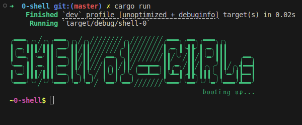

# 0-Shell Project

## Structure:

```
0-shell/
├── src/
│   ├── main.rs             // Entry point
│   ├── shell.rs            // Shell loop, prompt, and input handling
│   ├── parser.rs           // Command parsing logic
│   ├── commands/
│   │   ├── mod.rs
│   │   ├── echo.rs
│   │   ├── cd.rs
│   │   ├── ls.rs
│   │   ├── pwd.rs
│   │   ├── cat.rs
│   │   ├── cp.rs
│   │   ├── rm.rs
│   │   ├── mv.rs
│   │   ├── mkdir.rs
│   │   └── exit.rs
├── tests/
│   └── integration.rs      // Integration and command tests
├── Cargo.toml              // Rust project configuration
├── README.md               // Documentation
└── .gitignore
```
## Task Breakdown (Micro Tasks)
### 🔘 Epic 1: Shell Core
► **REPL Loop**
- Implement `$ ` prompt display
- Read user input with `stdin`
- Trim whitespace & ignore empty input
- Handle **Ctrl+D** → detect EOF and exit gracefully
- Split input into tokens (naive split by whitespace)
- Handle quoted arguments (basic `" "` parsing)

► **Dispatcher**
- Create a command map (`HashMap<&str, fn(Vec<String>)`)
- Implement unknown command handler → `"Command '<name>' not found"`
- Connect REPL loop with dispatcher

► **Simple Built-ins**
- Implement `exit` → exit with code 0
- Implement `echo` → print args joined with spaces
- Implement `pwd` → print `std::env::current_dir`

---

### 🔘 Epic 2: Navigation Commands

► **cd**
- Implement basic `cd <path>`
- Support `cd` with no args → go to `$HOME`
- Handle invalid paths (error message)
- Update prompt after `cd` (if bonus feature enabled)

► **ls**
- Implement basic `ls` (list current directory)
- Add `ls <path>` support
- Implement `-a`: include hidden files
- Implement `-F`: mark dirs with `/`, executables with `*`
- Implement `-l`:  
  - Show permissions string (`drwxr-xr-x`)  
  - Show ownership (user/group)  
  - Show file size  
  - Show modified timestamp  

---

### 🔘 Epic 3: File I/O

► **cat**
- Implement reading a single file → print to stdout
- Support multiple files → concatenate output
- Handle non-existent file → error message
- Handle permission denied → error message

► **cp**
- Implement copying file contents (read + write)
- Preserve file permissions
- Handle overwrite (default overwrite)
- Handle invalid source/target

► **mv**
- Implement move with `std::fs::rename`
- If rename fails, fallback to `copy + remove`
- Handle invalid args gracefully

---

### 🔘 Epic 4: File System Management

► **mkdir**
- Implement `mkdir <dir>`
- Implement `-p` (recursive create)
- Handle already exists error

► **rm**
- Implement removing a single file
- Handle removing non-existent file (error)
- Implement `-r` recursive delete
- Protect against accidental delete of `.` or `..`

► **Error Handling Framework**
- Define `ShellError` enum
- Create helper for standardized error messages
- Wrap filesystem calls with error-safe functions
- Ensure all commands use consistent error output

---

### 🔘 Usage

### Install Rust (latest version)

Follow the official installation guide:  
https://www.rust-lang.org/tools/install

Or run:

```bash
curl --proto '=https' --tlsv1.2 -sSf https://sh.rustup.rs | sh
```
Then restart your terminal and verify with:

```bash
rustc --version
```

---

### Build and Run

```bash
cargo build --release
./target/release/0-shell
```

You will see the shell prompt:

```text
0-shell$ 
```
<div align="center">
    <a href="https://github.com/EmanZHD/0-shell">
        
    </a>
</div>


---